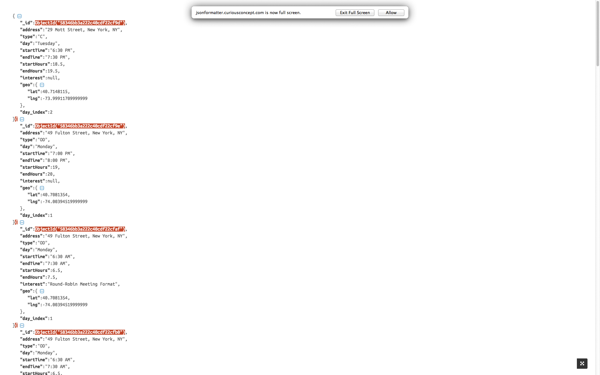
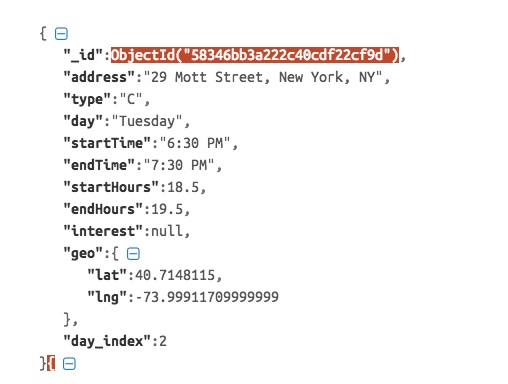
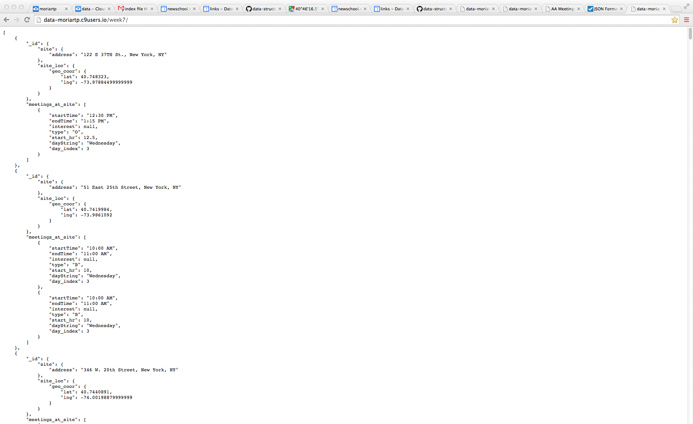
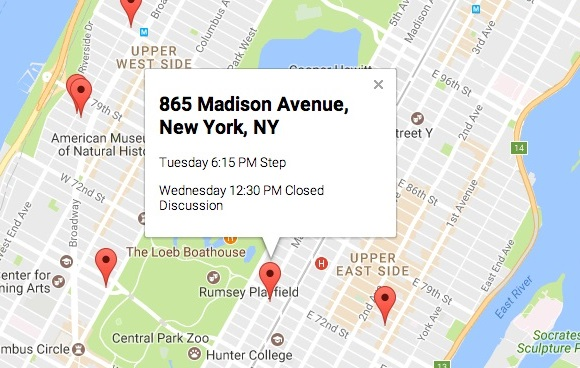
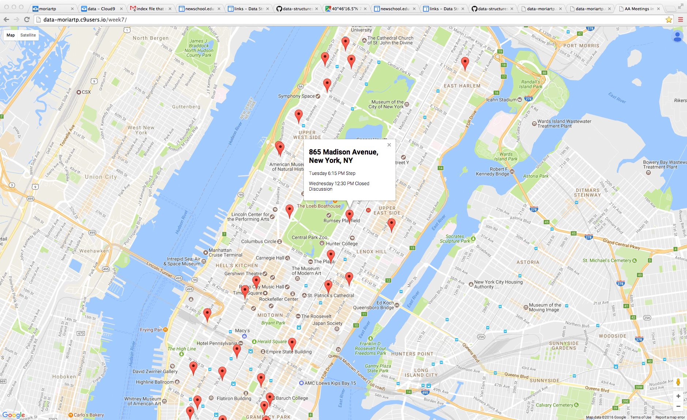

#Final Assignment 1

##scraper
aa site was scraped using the scraper.js file, and the results of that effort have been recorded in the scraper_output dir

##parser
Data in the scraper output was then targeted by html tag and parsed, collecting: 
*address (Street address of the venue)
*type (Coded meeting type)
*day (String variable for day of the week)
*startTime (String value for the meeting start)
*endTime (String value for the meeting end)

Using the parsed values a function was created to convert string values for time into hours from midnite, resulting n additional values:
*startHours (Hours from midnite)
*endHours (Hours from midnite)

Next using a google maps api, the parsed address values were used to extract gegraphical cordinates associated with the street address.
*geo (lon, lat array)

The output from this effort is logged in the parser_output dir.

##inserter
After setting up a mongo database in cloud9, the inserter.js file was then used to insert the meeting data as documents in a mongo collection. Note that after insertion into the database and additional variable was created using the mongo query language to convert the day values into numeric vaules 0-6. Additionally some of the values for startHours were modified to account form an error in the hours conversion. An illustration of these documents is shown below:

##aggregator
Using the mongo query language to create an aggregation piple, the 04_aggregator.js file returns an aggregation of data according to the following stages:

*$match day/hours conditions - effectively returns only meetings scheduled for the next 24 hours.
*$sort by day/hour - ensures nearest meeting times on top
*$group by location

An illustration of this output is shown below:

### application
Finally, a front end interface was develop with gogle maps to provide marker locations for each of the particular meeting site venue. The marker tooltip provide details about the day of the meeting, the startTime, and the type of meeting to be held. A screen shot of this working interface it illustrated below:

