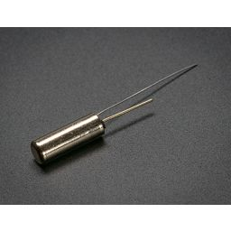
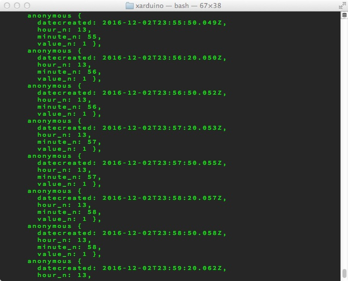
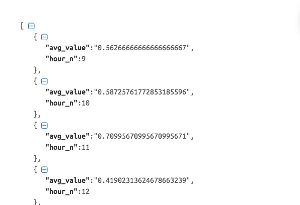
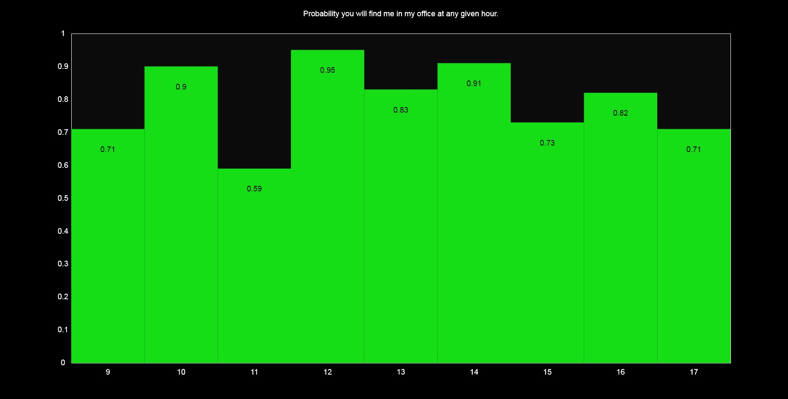

#Final Assignment 2

##hardware
For Final Assignment 2 I was provided with a tilt switch, and an arduino board, configured in the following manner:

##setup
The switch was setup to detect my physical presence at my office workstation. The device rested on my actual desktop, and could be flipped to indicate if I am "in" or "out" of the office. The aim of the project was to go beyond the log of scheduled meetings to make generate truer probability estimates about what time of day I am likely to be in my office. Beyond scheduled meetings, this data also reflects some of the informal business processes that might impact the probability of finding me at my desk at a given hour of the day. 

The below images illustrate the setup of the device.

##data collection
Suited for both analog and digital data capture, I elected a digital configuration. At 30 seconds intervals, the device reported/inserted timestamp, hour, minute, and binary 0/1 values (indicating presence) into a postgreSQL database hosted on Amazon Web Services. The below image illustrates a log of these insertion events.

##api
Following collection, I developed an API that provided per hour averages of the values collected, resulting in probability estimates for my physical presence at my office workstation. A sample of the API return is illustrated below:

##visualization
While the API was never connected to a functioning front-end interface, it is easy to see how these averages might be used to visualization the probability of my in-office presence over the course of a business day.

